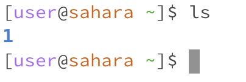

## Lab Report 1

1. No Arguments

cd - 

Working directory: /home (~)

Didn't change the directory, and if it was in a different directory, would have changed it back to home. No arguments means just running cd without anything.

Not an error.

ls - 

Working directory: /home (~)

Listed current directory (had a folder in it). No arguments means just running ls without anything.

Not an error.

cat - 

Working directory: /home (~)

Displayed nothing, was in infinite loop until stopped. No arguments means just running cat without anything.

Was an error, since it expected a file to display the contents of.

2. Path to a Directory

cd - 

Working directory: /home (~)

Path switched to the directory specified.

Not an error.

ls - 

Working directory: /home (~)

Listed contents of the directory, which had a text file in it (1.txt).

Not an error.

cat - 

Working directory: /home (~)

Gave an error saying it was a directory (and not a file).

Was an error, since it was expecting a file to display the contents of, not a directory.

3. Path to a File

cd - 

Working directory: /home (~)

Gave an error saying it was a file (not a directory).

Was an error, since it was expecting a directory to switch to, not a file.

ls - 

Working directory: /home (~)

Listed the file name itself with the path.

Not an error, it listed the file and the gave the name of it as the user asked for, even though it was expecting a directory to list contents of, not a file (and usually it would be used as such).

cat - 

Working directory: /home (~)

Printed the contents of the file (which has 1 character in it).

Not an error.
